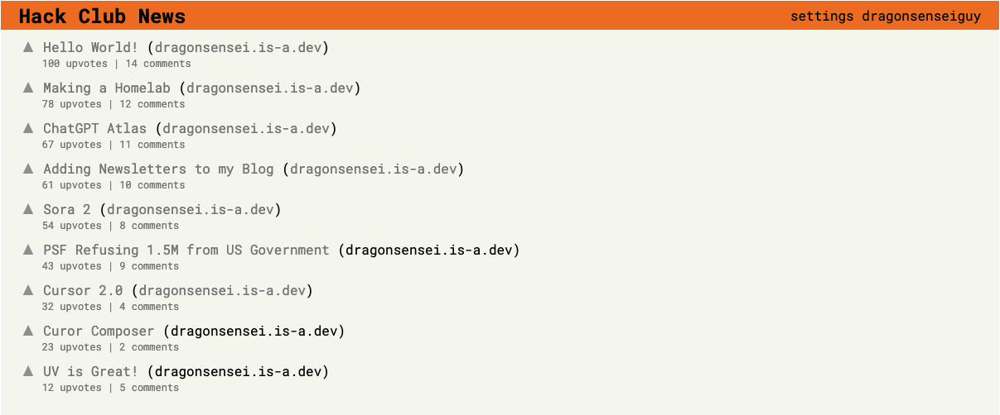

# Hack Club News

Hack Club News is a platform like [Hacker News](https://news.ycombinator.com/) for Hack Clubers to share any new and interesting news.

## Features

Hack Club News incudes
- Hacker News like posting capabilities
- User creation
- Data storage in a JSON file(I know it's not good practice, but it is simple)
- Custom Themes
- Commenting
- Upvoting


## Setup(macOS)
> [!NOTE]
> Most of these commands can also be changed for windows, but I don't own one so I can't test it.

Make a virtual environment
```
python3 -m venv .venv
source .venv/bin/activate
```

Instal dependencies:

This project uses `uv` so you need uv installed
```
uv sync
```

Start the development server

```
flask run --debug
```

## Screenshots
